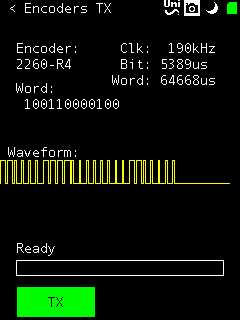
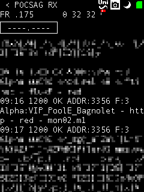
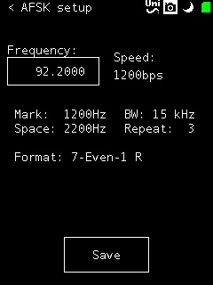
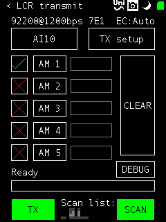
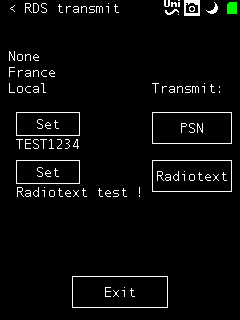
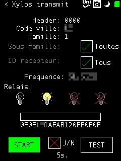
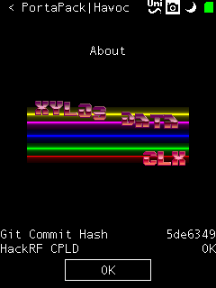
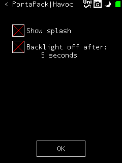

# portapack-HAVOC

HAVOC is a fork of the PortaPack H1 firmware, a portability add-on for the [HackRF One software-defined radio](http://greatscottgadgets.com/hackrf/).

Hardware is available at [ShareBrained Technology](http://sharebrained.com/portapack).

It is build on top of [ShareBrained's firmware](https://github.com/sharebrained/portapack-hackrf/), meaning that the original functionalities are kept (except when I don't sync for 2 months).

As its name implies, HAVOC's functionalities can be fun (or mean). You shouldn't use them. We never did.

**In most countries, radio transmissions are tightly regulated. Transmitting outside of free/public bands without a licence or authorization, even at very low power, is certainly forbidden where you live. Always bear that in mind. You're the ONLY ONE responsible for what you do with this software.**

# Fork features

* "Soundboard" wave file player from µSD (put 8-bit mono files in /wav directory)
* POCSAG 1200 alphanumeric receiver/decoder
* Simulate OOK frames from PT2262 encoders and friends (doorbells, remote outlets, some garage doors, ...)
* Nuoptix DTMF sync transmit (quite specific but can be useful in some theme parks :) )
* RDS (Radio Data System) PSN and Radiotext transmit
* Fully configurable AFSK transmit (Bell202)
* Virtual keyboard or Unistroke "handwriting" text input
* LCR (Language de Commande Routier) litteral message forming and transmit
* Xylos transmitter, street lighting control (NFM CCIR tones)
* "Play Dead" in case of emergency
* PWM audio RSSI output
* (Disabled for now) Close-Call™ style scanner
* (Disabled for now) Fully configurable jammer
* (Not used for now) Dynamic baseband code loading from SD card

# Screenshots

  
  
  

## Todo

* PMR446 transmit
* Frequency manager
* Detect/decode OOK
* Whistle (tone generator)
* POCSAG transmitter
* AFSK receiver
* Make SIGFOX interceptor work with all modules
* Wireless microphone transmit (with squelch tones)
* Number station
* EPAR transmit (old Xylos)
* Spectrum painter

**Visit the [wiki](https://github.com/furrtek/portapack-havoc/wiki) for more details.**

About the PWM RSSI output: Frequency is 800Hz in NFM and 500Hz in WFM. The data path is very messy, the RSSI thread running on the baseband core sends groups of values to the application RSSI widget which computes the average value, which sends it back to the baseband module for audio output (if enabled)...

# Thanks

* Sig and cLx for research on AFSK LCR, Xylos, and for lending remote-controlled outlets
* Rainer Matla for the donation :)
* Keld Norman for ideas and suggestions

# License

Except where specified in subdirectories of this project, all work is offered under the following license:

Copyright (C) 2013-2015 Jared Boone, ShareBrained Technology, Inc.

Copyright (C) 2015-2016 Furrtek

This program is free software; you can redistribute it and/or
modify it under the terms of the GNU General Public License
as published by the Free Software Foundation; either version 2
of the License, or (at your option) any later version.

This program is distributed in the hope that it will be useful,
but WITHOUT ANY WARRANTY; without even the implied warranty of
MERCHANTABILITY or FITNESS FOR A PARTICULAR PURPOSE.  See the
GNU General Public License for more details.

You should have received a copy of the GNU General Public License
along with this program; if not, write to the Free Software
Foundation, Inc., 51 Franklin Street, Fifth Floor, Boston, MA
02110-1301, USA.

# Contact

## Original firmware and hardware

Jared Boone <jared@sharebrained.com>

ShareBrained Technology, Inc.

<http://www.sharebrained.com/>

The latest version of this repository can be found at
https://github.com/sharebrained/portapack-hackrf/

## HAVOC specific things

Furrtek <furrtek@gmail.com>

<http://www.furrtek.org>
