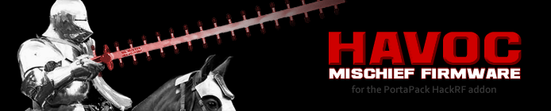
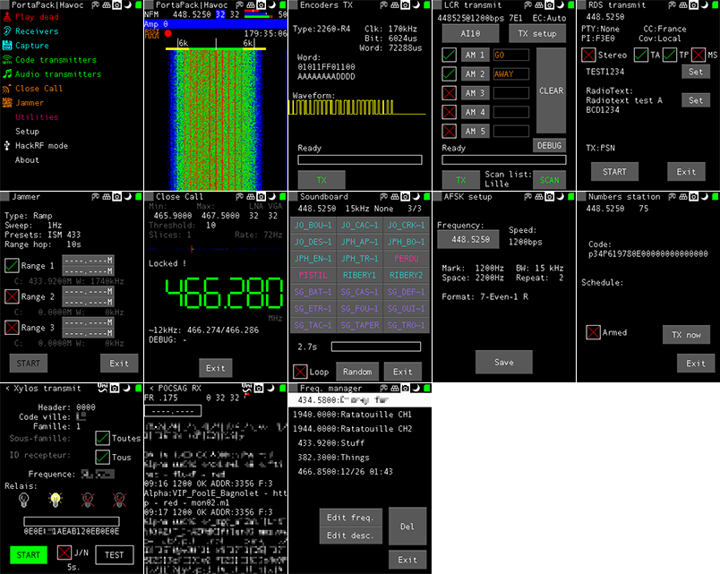

HAVOC is a fork of the PortaPack H1 firmware, a portability add-on for the [HackRF One software-defined radio](http://greatscottgadgets.com/hackrf/).

Hardware is available at [ShareBrained Technology](http://sharebrained.com/portapack).

It is build on top of [ShareBrained's firmware](https://github.com/sharebrained/portapack-hackrf/), meaning that the original functionalities are kept (except when I don't sync for 2 months).

# Documentation

[READ THE WIKI](https://github.com/furrtek/portapack-havoc/wiki/Home/)

Do you want to submit a bug report, suggest something, ... ? Don't hesitate, go here: https://github.com/furrtek/portapack-havoc/issues (Check the progress list below first).

# Summary

As its name implies, HAVOC's functionalities can be fun, mean and even useful sometimes. You shouldn't use them. No. Bad. Put it down.

**In most countries, radio transmissions are tightly regulated. Transmitting outside of free/public bands without a licence or authorization, even at very low power, is certainly forbidden where you live. Always bear that in mind. You're the ONLY ONE responsible for what you do with this software.**

# Fork features

* Microphone transmit with CTCSS
* Frequency manager (save & load from SD card)
* "Soundboard" wave file player (put 8-bit mono files in SD card /wav directory)
* POCSAG 512/1200/2400 transmitter
* POCSAG 512/1200/2400 receiver/decoder
* Morse transmitter (FM tone and CW)
* OOK transmitter for common remote encoders (PT2262, doorbells, remote outlets, some garage doors, ...)
* RDS (Radio Data System) PSN, RadioText and Time groups transmitter
* Fully configurable jammer
* Scheduled numbers station (for spies on a budget, alerts, LARP scenarios, ...)
* Nuoptix DTMF sync transmitter (quite specific but can be useful in some theme parks :) )
* AFSK transmitter (Bell202...)
* Virtual keyboard or Unistroke "handwriting" text input
* LCR (Language de Commande Routier) message generator
* Xylos transmitter, street lighting control (CCIR tones)
* "Play Dead" in case of emergency
* Utilities such as tone generator and CW transmitter
* PWM audio RSSI output (for crude direction finding)

# Progress

Feature | Progress | Notes
------- | -------- | -----
POCSAG RX   | 95% | Needs support for numeric messages
Morse TX    | 95% | Needs fox hunt scheduler and live keying mode
Mic. TX     | 95% | Carrier leak bug, need to find guard tones for various brands of wireless mics
RDS TX      | 90% | Radiotext isn't quite right yet
Close-Call™ | 85% | Needs adjustments and optimization for wider frequency range
SSTV TX     | 80% | Needs better bitmap file handling, support for other modes (ROBOT ?) and callsign FSK ID
IQ replay   | 50% | High priority
Sigfox RX   | 40% | Tuning basics done, needs decoding code and testing
ADS-B TX    | 40% | UI and frame gen stuff done, needs baseband module
Wave visualizer | 30% | Only the widget is ready, high priority
Generic TXs | 5%  | Raw AX.25, AFSK, FSK, CCIR, DTMF... Tonesets are ready
SI4032 TRX  | 0%  | And other sub-GHz transceiver chips
SSTV RX     | 0%  |
ADS-B RX    | 0%  | Could be fun. Is sensitivity high enough ?
Scanner     | 0%  | Easy, could be used with POCSAG RX to catch jumping channels
SSB TX      | 0%  | Requested but math is hard :(
OOK RX      | 0%  | See if rtl_433's author is fine with using protocol defs
AFSK RX     | 0%  | Shouldn't be too hard, bit-time shift and mix method ?
Analog TV TX| 0%  | Enough CPU ? B&W and no sound ?
LoJack RX   | 0%  | Basically AFSK RX
DMR info RX | 0%  | Retrieve DMR channel info. **No voice** because of vocoder complexity and possible legal issue
Tetra info? | 0%  | Same

# Screenshots

# Thanks

* Sig and cLx for research on AFSK LCR, Xylos, and for lending remote-controlled outlets
* Rainer Matla and DC1RDB for the donations :)
* Keld Norman and Giorgio Campiotti for ideas and suggestions

# License

Except where specified in subdirectories of this project, all work is offered under the following license:

Copyright (C) 2013-2015 Jared Boone, ShareBrained Technology, Inc.

Copyright (C) 2015-2016 Furrtek

This program is free software; you can redistribute it and/or
modify it under the terms of the GNU General Public License
as published by the Free Software Foundation; either version 2
of the License, or (at your option) any later version.

This program is distributed in the hope that it will be useful,
but WITHOUT ANY WARRANTY; without even the implied warranty of
MERCHANTABILITY or FITNESS FOR A PARTICULAR PURPOSE.  See the
GNU General Public License for more details.

You should have received a copy of the GNU General Public License
along with this program; if not, write to the Free Software
Foundation, Inc., 51 Franklin Street, Fifth Floor, Boston, MA
02110-1301, USA.

# Contact

## Original firmware and hardware

Jared Boone <jared@sharebrained.com>

ShareBrained Technology, Inc.

<http://www.sharebrained.com/>

The latest version of this repository can be found at
https://github.com/sharebrained/portapack-hackrf/

## HAVOC specific things

Furrtek <furrtek@gmail.com>

<http://www.furrtek.org>
